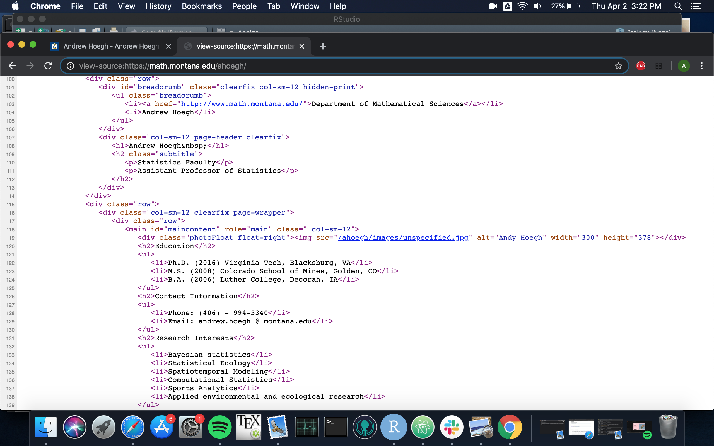
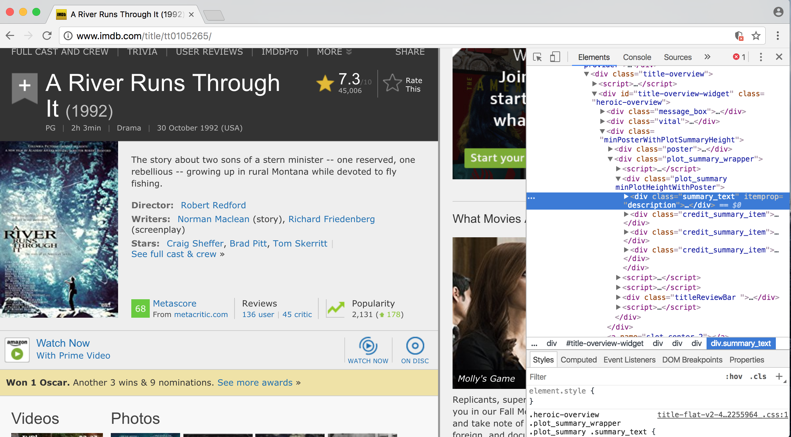

```{r setup, include=FALSE}
library(dplyr)
library(knitr)
library(rvest)
library(stringr)
knitr::opts_chunk$set(echo = TRUE)
knitr::opts_chunk$set(eval = F)
```

# Data Scraping

## Data Scraping

Data scraping is defined as using a computer to extract information, typically from human readable websites. We could spend multiple weeks on this, so this will be a basic introduction that will allow you to:

- extract text and numbers from webpages and
- extract tables from webpages.

## A bit about HTML

HTML elements are written with a start tag, an end tag, and with the content in between: <tagname>content</tagname>. The tags which typically contain the textual content we wish to scrape. Some tags include:

- $<h1>$, $<h2>$,…,: for headings
-  $<p>$: Paragraph elements
- $<ul>$: Unordered bulleted list
- $<ol>$: Ordered list
- $<li>$: Individual List item
- $<div>$: Division or section
- $<table>$: Table

## HTML Example


## HTML Example




## Scraping with rvest
```{r, eval = T}
library(rvest)
library(stringr)
andy <- read_html("https://math.montana.edu/ahoegh/")
```

## Scraping with rvest
```{r, eval = T}
 andy %>% html_nodes('h1') 
 andy %>% html_nodes('h1')  %>% html_text()
 andy %>% html_nodes('h2') %>% html_text()
 andy %>% html_nodes('p') %>% html_text()
```

## Scraping with rvest
```{r, eval = T}
 andy %>% html_nodes('p') %>% html_text()
```


## Tidying Up
```{r, eval = T}
andy %>% html_nodes('h2')  %>% html_text() %>% 
  str_replace_all(pattern = "\n", replacement = "")
```

## Scraping li to find email address
```{r, eval = T}
andy %>% html_nodes('li')  %>% html_text() %>% 
  str_replace_all(pattern = "\n", replacement = "")

```


## Scraping li to find email address
```{r, eval = T}
info <- andy %>% html_nodes('li')  %>% html_text() %>% 
  str_replace_all(pattern = "\n", replacement = "")
info[str_detect(info, '@')]
```


## A River Runs Through It




## Get Movie Title
```{r, eval = T }
river <- read_html("http://www.imdb.com/title/tt0105265/")
title <- river %>%  html_nodes('title') %>% html_text()  
```

The movie title is _`r title`._


## Get Story line
```{r, eval = T }
river <- read_html("http://www.imdb.com/title/tt0105265/")
story.line <- river %>% 
  html_nodes('#titleStoryLine') %>% 
  html_nodes('p') %>% html_text()  %>%
  str_replace_all(pattern = "\n", replacement = "")
```
The storyline is : `r story.line`.


## Scraping Tables
[http://www.montana.edu/marketing/about-msu/](http://www.montana.edu/marketing/about-msu/)

```{r, eval = T}
info_table <- read_html("http://www.montana.edu/marketing/about-msu/") %>% html_nodes('table') %>% html_table() 
kable(info_table[[2]])
```
